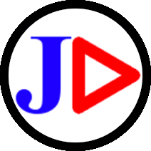
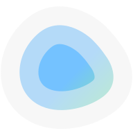
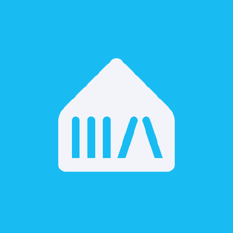

# Alex's unRAID Docker Templates

Easy to use Docker templates for unRAID.

## youtube-dl by Jeeaaasus

> Automated yt-dlp Docker image for downloading YouTube subscriptions

- 📖 [GitHub Repository](https://github.com/Jeeaaasus/youtube-dl)
- 🐳 [Docker Hub](https://hub.docker.com/r/jeeaaasustest/youtube-dl)

## Dockge by Louis Lam

> A fancy, easy-to-use and reactive self-hosted docker compose.yaml stack-oriented manager.

- 📖 [GitHub Repository](https://github.com/louislam/dockge)
- 🐳 [Docker Hub](https://hub.docker.com/r/louislam/dockge)

## Dex IDP

> Integrate any identity provider into your application using OpenID Connect.

- 🏠 [Homepage](https://dexidp.io/)
- 📖 [GitHub Repository](https://github.com/dexidp/dex)
- 🐳 [Docker Hub](https://hub.docker.com/r/dexidp/dex)

## Music Assistant

> Music Assistant is a free, open source music library manager. It brings your streaming services and your own files together into one library, and plays them on almost any speaker in the house.

- 📖 [GitHub Repository](https://github.com/music-assistant/server)
